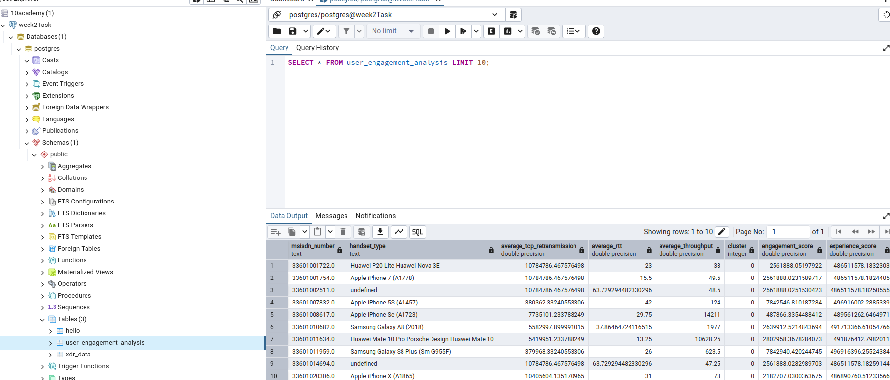

# Telecom Data Analysis 

This project demonstrates a comprehensive data analysis pipeline using a Jupyter Notebook. The analysis includes variable identification and description, variable transformations, basic metrics computation, univariate and bivariate analysis, correlation analysis, and dimensionality reduction using Principal Component Analysis (PCA).

## Prerequisites

Ensure you have the following libraries installed:

- pandas
- numpy
- matplotlib
- seaborn
- sqlalchemy
- plotly
- scikit-learn

You can install the required libraries using pip:

```bash
pip install pandas numpy matplotlib seaborn sqlalchemy plotly scikit-learn
```

Setup and Data Import
Connect to Database: Establish a connection to your database using SQLAlchemy. Ensure to configure the connection parameters (e.g., database type, user, password, host, database name).

Load Data: Use a SQL query to load the dataset from the specified table in the database.

Variable Identification and Description
Data Overview:

Get an overview of the dataset, including the number of rows and columns, and data types of each column.

Summarize the numerical and categorical variables to understand their distributions and key statistics.

### Executing user_overview_analysis


Variable Transformations
Compute Total Duration: Calculate the total duration for each user by aggregating session durations.

Segment Users: Divide users into decile classes based on their total duration.

Compute Total Data: Calculate the total data for each session by summing the download and upload data.

Aggregate Data: Group the data by decile class and compute the total data per decile class.

Basic Metrics
Compute Metrics: Calculate basic statistical metrics for the total duration, including mean, median, and standard deviation. These metrics provide insights into the central tendency and variability of the data.

Non-Graphical Univariate Analysis
Dispersion Parameters: Compute the range, variance, and interquartile range (IQR) for the total duration to understand the spread and variability in the data.

Graphical Univariate Analysis
Histograms: Create histograms to visualize the distribution of the total duration.

Boxplots: Use boxplots to identify the spread and detect outliers in the total duration.

Bar Charts: Create bar charts to display the count of each categorical variable, such as handset manufacturers. Use Plotly for interactive and readable visualizations.

Bivariate Analysis
Scatter Plots: Create scatter plots to explore the relationship between the total data and various categorical variables.

Correlation Coefficient: Calculate the correlation coefficient to quantify the strength and direction of relationships between numerical variables.

Correlation Analysis
Correlation Matrix: Compute a correlation matrix for selected variables to understand their pairwise relationships. Visualize the matrix using a heatmap for better interpretation.

Dimensionality Reduction
Standardize Data: Standardize the data before performing PCA to ensure each variable contributes equally to the analysis.

Perform PCA: Conduct Principal Component Analysis to reduce the dimensionality of the dataset while retaining most of the variance.

Interpret Results: Analyze the explained variance ratio to determine the proportion of variance captured by each principal component. Visualize the principal components to understand the clustering and spread of data points.

### Executing user_engagement_analysis

Advanced Customer Engagement Analysis
 Aggregate Metrics per Customer
Compute Metrics: Aggregate the total duration, total data (DL+UL), and other relevant metrics for each customer (MSISDN). Identify and report the top 10 customers based on these engagement metrics.

Normalize Metrics and Run K-Means Clustering
Normalize Metrics: Normalize the engagement metrics to prepare for k-means clustering. Apply k-means clustering with k=3 to classify customers into three distinct engagement groups.

Interpret Clustering: Visualize the resulting clusters using scatter plots to understand the distribution and separation of the clusters.

Compute Cluster Metrics
Aggregate Metrics for Clusters: Calculate the minimum, maximum, average, and total metrics for each cluster. Visualize the results using appropriate plots to interpret the clustering outcomes.

Aggregate User Traffic per Application
Compute Application Traffic: Calculate the total data usage per application for each customer. Identify and report the top 10 most engaged users for each application.

Plot Top Applications
Visualize Top Applications: Create bar charts to visualize the top 3 most used applications by the top 10 customers for each application. This helps identify key user behaviors and preferences.

Determine Optimal Number of Clusters (k)
Elbow Method: Use the elbow method to determine the optimal number of clusters (k) by plotting the sum of squared distances (SSE) against different values of k. Identify the "elbow point" where the SSE starts to decrease more slowly, indicating the optimal number of clusters.

The optimal number of clusters for this data was found to be k=5 which is at the elbow point, where the SSE levels off which in turn ensures the clusters are compact and meaningful.

### Executing user_experience_analysis

Aggregate Information Per Customer
Handle missing values by replacing them with the mean or mode.

Aggregate the data per customer using the mean for continuous variables and the mode for categorical variables (handset type).

Compute & List Top, Bottom, and Most Frequent Values
Use pandas functions to list the nlargest, nsmallest, and value_counts for the respective metrics.

Compute & Report Distributions
Group the aggregated data by handset type and compute the mean for average throughput and TCP retransmission.

Visualize the distributions using Plotly for better readability and interaction.

K-Means Clustering
Standardize the features (average TCP retransmission, average RTT, and average throughput).

Apply k-means clustering to segment the users into three groups.

Cluster 0:
Interpretation: Cluster 0 represents users experiencing moderate network quality. They have stable connections with lower throughput and moderate round-trip times. This group might consist of users who have consistent but not particularly fast internet experiences.

Cluster 1:
Interpretation: Cluster 1 represents users experiencing good network quality. They have high throughput and low latency, indicating a strong and efficient connection. However, they might face some retransmission issues, which could occasionally disrupt their internet experience.

Cluster 2:
Interpretation: Cluster 2 represents users with the highest throughput, indicating very high-speed network connections. However, this group faces significant retransmission issues, which could impact the overall network experience despite the high speeds. They experience moderate round-trip times.

### Executing user_satisfaction_analysis
Assign Engagement and Experience Scores
Compute the engagement score as the Euclidean distance between the user data point and the less engaged cluster.

Compute the experience score as the Euclidean distance between the user data point and the worst experience cluster.

Compute Satisfaction Score
Consider the average of both engagement and experience scores as the satisfaction score.

Report the top 10 satisfied customers.

Build a Regression Model
Build a regression model to predict the satisfaction score based on engagement and experience metrics.

K-Means Clustering on Engagement and Experience Scores
Perform k-means clustering with k=2 on the engagement and experience scores.

Aggregate Average Scores Per Cluster
Aggregate the average satisfaction and experience scores per cluster.

Export Final Table to PostgreSQL Database
Export the final table containing all user IDs, engagement, experience, and satisfaction scores to a local PostgreSQL database.

The following image shows the screenshot of the table in the database

